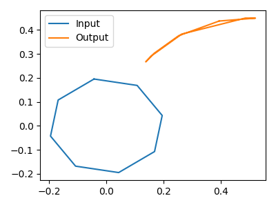

# OnshapeFlaskServer
Python-based Flask Server for communicating with Onshape

Lead developer: Alexander Koppel

---
## Description:

This project creates a flask server that can be accessed within Onshape as an "_Integrated Cloud App_" through the 
"_App Store_" as an app called
"_[Tufts CEEO Flask App](https://appstore.onshape.com/apps/Design%20&%20Documentation/L2TGY3UQFV4RPW7XMYDTQ76QXIK6NYLFUBT7NSI=/description)_"
(which is private to the Rogers Onshape Enterprise at the moment). This flask server uses Onshape's REST API to edit and 
display information about the current workspace in real time. 

For more information about Onshape's REST API you can:
- Look at Onshape's [integration guides](https://github.com/PTC-Education/Onshape-Integration-Guides)
- Read their documentation provided on [Glasswork](https://cad.onshape.com/glassworks/explorer/#/)
- Check out example API calls through PTC's [API playground](https://github.com/PTC-Education/PTC-API-Playground)

This project started using Onshape's [_Heat Sink Design Project_](https://github.com/PTC-Education/Heat-Sink-Design) 
as a base along with Onshape's [_Four Bar Mechanism Design Project_](https://github.com/PTC-Education/Four-Bar-Mechanism) 
as inspiration for the "_CEEO Rotate & Graph_" extension.

This project contains three separate tools:
- CEEO Rotate & Graph
- CEEO Image Maker
- CEEO GIF Maker

---
## How To Run:

1. Download python
   1. Make sure the PATH is correctly setup and PIP is also installed
      1. To check python is installed, run `python --version` or `py --version`
         1. I used Python 3.10.5 - 64 bit
      2. To check your python PATH works, run `python` or `py` in terminal.
         1. You can exit with `exit()` or `^Z` (Ctrl-Z)
      3. To check pip is installed, run `pip --version`
         1. I used pip 22.0.4
2. Download/clone this repository! The easiest method is to "Download Zip", and then unzip the file.
3. Next in the terminal (in your python IDE of choice, I recommend PyCharm) run `pip install -r requirements.txt`
   1. Make sure you are inside the file that contains the code when you run this command by either using the terminal in
your ide or using the `cd` command.
   2. If you are using PyCharm, you can just open the file in PyCharm and press the "install requirement" button.
4. Next follow the instructions
[here](https://github.com/PTC-Education/Onshape-Integration-Guides/blob/main/API_Intro.md#2-generating-your-onshape-api-keys)
to create your Onshape API Keys. Only create the keys, next step is how to use and save them.
5. Once you have your two API keys, save them in the file called "OnshapeAPIKey.py" with the template shown below.
   1. The exact file can be found at "_examples/OnshapeAPIKey.py_", but if that file is used, it needs to be moved to
the main folder (out of "_OnShapeFlaskServer/examples_" and into "_OnShapeFlaskServer_"), replacing "ACCESS" and "SECRET"
with the new respective keys you created.
   2. The file should look like this, with both keys on their own line:  
      `access = 'ACCESS'`  
      `secret = 'SECRET'`
6. Next make sure you are on the "Rogers" Onshape enterprise, then subscribe to the app called
[_Tufts CEEO Flask App_](https://appstore.onshape.com/apps/Design%20&%20Documentation/L2TGY3UQFV4RPW7XMYDTQ76QXIK6NYLFUBT7NSI=/description).
   1. If you are not on the "Rogers" Onshape enterprise, follow the steps below in making your own Onshape App.
7. Make sure your browser accepts the certificates provided in this GitHub following
[these steps](https://github.com/PTC-Education/Onshape-Integration-Guides/blob/main/Flask_Intro.md#3-configure-flask-as-https). 
   1. You do not need to make your own certificates. Skip the first step and instead start at: "_Then, you need to add 
this newly created certificates to be a trusted certificate of your computer system._"
8. To start the Flask Server run one of the commands below (depending on your terminal and operating system):
   1. Windows powershell: `$env:FLASK_APP = "OnshapeFlaskApp.py"; $env:FLASK_ENV= "development" ; flask run --cert=cert.pem --key=key.pem`

 

That is it! Feel free to edit the flask app and learn how it works through its commits. Theoretically any API call can
be run through this flask app, so I encourage checking out the earlier given examples of their documentation provided on
[Glasswork](https://cad.onshape.com/glassworks/explorer/#/) and checking out example API calls through PTC's 
[API playground](https://github.com/PTC-Education/PTC-API-Playground)

---

### Making Your Own Onshape App
1. To set up your own Onshape app through OAuth, follow the instructions provided by PTC's 
[Onshape Integration Guides](https://github.com/PTC-Education/Onshape-Integration-Guides/blob/main/Flask_Intro.md#41-onshape-integration-through-oauth).
2. Afterwards, to run the three tools shown here, you need to add three extensions to your app.
   1. First to add extensions:
      1. Go to "_OAuth applications_" in the Onshape [Developer Portal](https://dev-portal.onshape.com/)
      2. Select your app
      3. Go to "_Extensions_"
      4. Press "_Add Extension_"
   2. CEEO Rotate & Graph: In location `Element right panel` with context of a `Selected assembly` and an action url 
   of `https://127.0.0.1:5000/home?documentId={$documentId}&workspaceId={$workspaceId}&elementId={$elementId}`
   3. CEEO Image Maker: In location `Element right panel` with context of a `Selected part studio` and an action url
   of `https://127.0.0.1:5000/home2?documentId={$documentId}&workspaceId={$workspaceId}&elementId={$elementId}`
   4. CEEO GIF Maker: In location `Element right panel` with context of a `Selected assembly` and an action url
   of `https://127.0.0.1:5000/home3?documentId={$documentId}&workspaceId={$workspaceId}&elementId={$elementId}`

The rest you can edit as you see fit.

---
## Review of Tools: 
Instructions of the different tools this project creates and how to use them.
***IN PROGRESS***

#### - CEEO Rotate & Graph:
This is a tool for Onshape's **Assembly**. It rotates any given part around the Z-Axis, centered at the origin. (Updates
including other directions are planned but not yet implemented). It always rotates the parts a full 360 degrees, but the
number of steps it takes to complete that rotation can be edited (default 6). When the part is being rotates, two part
can be selected and their x and y position is tracked and graphed. The first part is the "Input" (normally the moving
part) and the second part is the "Output" (the part you want to observe as it moves along). I recommend making little
small trackers and attacking them to the points you want to specifically observe as the position of a big piece is 
the center of the piece, not the edges you probably want to track. Examples below!

#### - CEEO Image Maker:
This is a tool for Onshape's **Part Studio**.

#### - CEEO GIF Maker:
This is a tool for Onshape's **Assembly**.

---
This project created by the Tufts Center for Engineering Education and Outreach (CEEO).

For more innovations from the Tufts CEEO, visit: https://www.ceeoinnovations.org/
