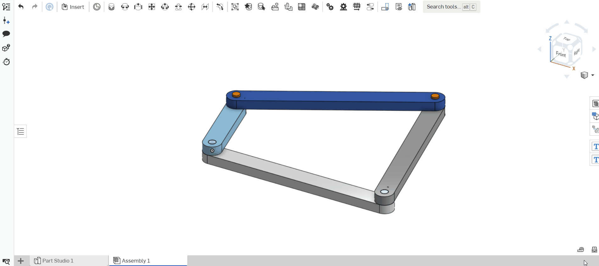
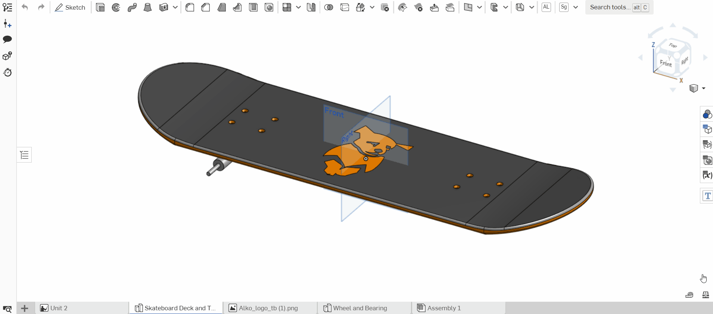
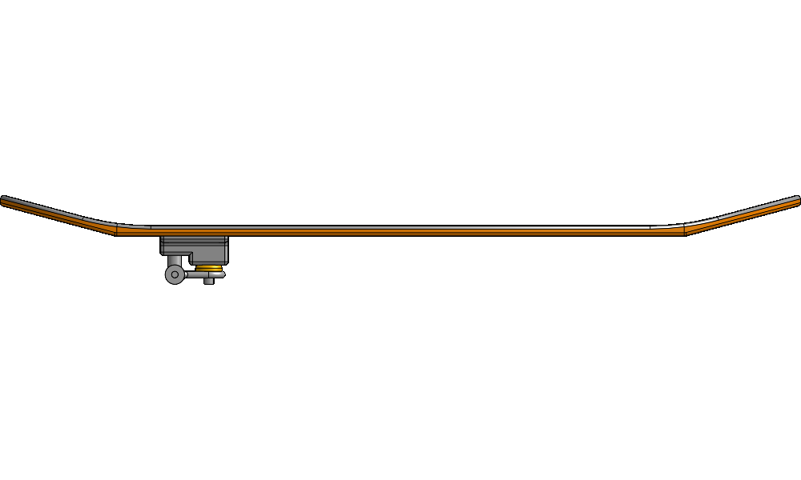
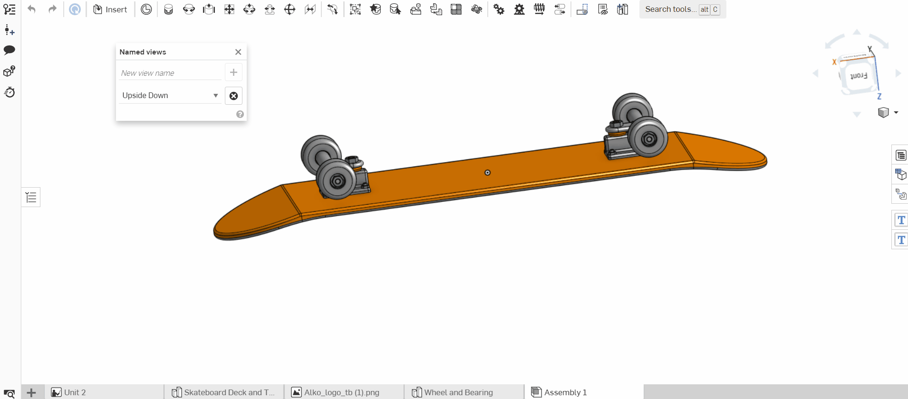

# OnshapeFlaskServer
Python-based Flask Server for communicating with Onshape

Lead developer: Alexander Koppel

---
## Description:

This project creates a flask server that can be accessed within Onshape as an "_Integrated Cloud App_" through the 
"_App Store_" as an app called
"_[Tufts CEEO Flask App](https://appstore.onshape.com/apps/Design%20&%20Documentation/L2TGY3UQFV4RPW7XMYDTQ76QXIK6NYLFUBT7NSI=/description)_"
(which is private to the Rogers Onshape Enterprise at the moment). This flask server uses Onshape's REST API to edit and 
display information about the current workspace in real time. 

For more information about Onshape's REST API you can:
- Look at Onshape's [integration guides](https://github.com/PTC-Education/Onshape-Integration-Guides)
- Read their documentation provided on [Glasswork](https://cad.onshape.com/glassworks/explorer/#/)
- Check out example API calls through PTC's [API playground](https://github.com/PTC-Education/PTC-API-Playground)

This project started using Onshape's [_Heat Sink Design Project_](https://github.com/PTC-Education/Heat-Sink-Design) 
as a base along with Onshape's [_Four Bar Mechanism Design Project_](https://github.com/PTC-Education/Four-Bar-Mechanism) 
as inspiration for the "_CEEO Rotate & Graph_" extension.

This project contains five separate tools:
- CEEO Rotate & Graph
- CEEO Image Maker
- CEEO GIF Maker
- CEEO Create & Edit
- CEEO Jupyter

---
## How To Run:
*These instructions where written with Windows machines in mind, but should work for all machines*

1. Download python
   1. Make sure the PATH is correctly setup and PIP is also installed
      1. To check python is installed, run `python --version` or `py --version` in terminal.
([How to access you terminal](https://www.ionos.com/help/email/troubleshooting-mail-basicmail-business/access-the-command-prompt-or-terminal/#:~:text=Click%20Start%20and%20search%20for,cmd%22%20and%20then%20click%20OK.))
         1. I used Python 3.10.5 - 64 bit
         2. Having multiple python versions can cause issues when trying to run Flask
      3. To check your python PATH works, run `python` or `py` in terminal.
         1. You can exit with `exit()` or `^Z` (Ctrl-Z)
      4. To check pip is installed, run `pip --version`
         1. I used pip 22.0.4
2. Download/clone this repository. The easiest method is to "Download Zip", and then unzip the file.
3. Next in the terminal run `pip install -r requirements.txt`
   1. Make sure you are inside the file that contains the code when you run this command by either using the terminal in
your ide or using the `cd` command.
   2. If you are using PyCharm (what I used), you can just open the file in PyCharm and press the "install requirement"
button.
4. Next follow the instructions
[here](https://github.com/PTC-Education/Onshape-Integration-Guides/blob/main/API_Intro.md#2-generating-your-onshape-api-keys)
to create your Onshape API Keys. Only create the keys, next step is how to use and save them.
5. Once you have your two API keys, save them in the file called "OnshapeAPIKey.py" with the template shown below.
   1. The exact file can be found at "_examples/OnshapeAPIKey.py_", but if that file is used, it needs to be moved to
the main folder (out of "_OnShapeFlaskServer/examples_" and into "_OnShapeFlaskServer_"), replacing "ACCESS" and "SECRET"
with the new respective keys you created.
   2. The file should look like this, with both keys on their own line:  
      `access = 'ACCESS'`  
      `secret = 'SECRET'`
6. Next make sure you are on the "Rogers" Onshape enterprise, then subscribe to the app called
[_Tufts CEEO Flask App_](https://appstore.onshape.com/apps/Design%20&%20Documentation?sort=date) under Design & Documentation.
   1. If you are not on the "Rogers" Onshape enterprise, follow the steps below (**Making Your Own Onshape App**) in
making your own Onshape App.
7. Make sure your browser accepts the certificates provided in this GitHub following
[3. Configure Flask as HTTPS](https://github.com/PTC-Education/Onshape-Integration-Guides/blob/main/Flask_Intro.md#3-configure-flask-as-https). 
   1. You do not need to make your own certificates as certificates have been provided titled "cert.pem" and "key.pem".
Skip the first step and instead start at: "_Then, you need to add this newly created certificates to be a trusted
certificate of your computer system._"
8. To start the Flask Server run one of the commands below (depending on your terminal and operating system):
   1. Powershell: `$env:FLASK_APP = "OnshapeFlaskApp.py"; $env:FLASK_ENV= "development" ; $env:FLASK_RUN_PORT = 5687 ; flask run --cert=cert.pem --key=key.pem`
   2. CMD: `set FLASK_APP=OnshapeFlaskApp.py & set FLASK_ENV=development & set FLASK_RUN_PORT=5687 & flask run --cert=cert.pem --key=key.pem`
   3. Bash: `export FLASK_APP=OnshapeFlaskApp.py ; export FLASK_ENV=development ; export FLASK_RUN_PORT=5687 ; flask run --cert=cert.pem --key=key.pem`
   4. Fish Shell: `set -x FLASK_APP OnshapeFlaskApp.py ; set -x FLASK_ENV development ; set -x FLASK_RUN_PORT 5687 ; flask run --cert=cert.pem --key=key.pem`
  
9. **_DEBUGGING:_** Sometimes the website will be blocked by your web browser. Open https://127.0.0.1:5687 in a new tab
and allow it.
10. **_DEBUGGING:_** Sometimes these commands also won't work fully if run in the same line as shown above, if that is
the case you can run each line separately as long as the final line is run last. Here are the separate lines below:
    1. Powershell:
       1. `$env:FLASK_APP = "OnshapeFlaskApp.py"`
       2. `$env:FLASK_ENV= "development"`
       3. `$env:FLASK_RUN_PORT = 5687`
    2. CMD:
       1. `set FLASK_APP=OnshapeFlaskApp.py`
       2. `set FLASK_ENV=development`
       3. `set FLASK_RUN_PORT=5687`
    3. Bash:
       1. `export FLASK_APP=OnshapeFlaskApp.py`
       2. `export FLASK_ENV=development`
       3. `export FLASK_RUN_PORT=5687`
    4. Fish Shell:
       1. `set -x FLASK_APP OnshapeFlaskApp.py`
       2. `set -x FLASK_ENV development`
       3. `set -x FLASK_RUN_PORT 5687`
    5. **Final line:** `flask run --cert=cert.pem --key=key.pem`
11. Extra setup is needed for JupyterLite to get the _CEEO Jupyter_ tool to work, please read the description of the
tool given below to learn more. Setup is very simple, just not needed for other tools.
 

That is it! Feel free to edit the flask app and learn how it works through the left behind commits. Theoretically any
API call can be run through this flask app, so I encourage checking out the earlier given examples of their
documentation provided on [Glasswork](https://cad.onshape.com/glassworks/explorer/#/) and checking out example API
calls through PTC's [API playground](https://github.com/PTC-Education/PTC-API-Playground)

---

### Making Your Own Onshape App
1. To set up your own Onshape app through OAuth, follow the instructions provided by PTC's Onshape integration guides
[4.1. Onshape integration through OAuth](https://github.com/PTC-Education/Onshape-Integration-Guides/blob/main/Flask_Intro.md#41-onshape-integration-through-oauth).
2. Afterwards, to run the five tools shown here, you need to add five extensions to your app.
   1. First to add extensions:
      1. Go to "_OAuth applications_" in the Onshape [Developer Portal](https://dev-portal.onshape.com/)
      2. Select your app
      3. Go to "_Extensions_"
      4. Press "_Add Extension_"
   2. Follow the steps bellow to set up each tool. Anything not mentioned you can edit as you see fit:
      1. **CEEO Rotate & Graph**: In location `Element right panel` with context of a `Selected assembly` and an action
      url of `https://127.0.0.1:5687/home?documentId={$documentId}&workspaceId={$workspaceId}&elementId={$elementId}`
      2. **CEEO Image Maker**: In location `Element right panel` with context of a `Selected part studio` and an action
      url of `https://127.0.0.1:5687/home2?documentId={$documentId}&workspaceId={$workspaceId}&elementId={$elementId}`
      3. **CEEO GIF Maker**: In location `Element right panel` with context of a `Selected assembly` and an action url
      of `https://127.0.0.1:5687/home3?documentId={$documentId}&workspaceId={$workspaceId}&elementId={$elementId}`
      4. **CEEO Create & Edit**: In location `Element right panel` with context of a `Selected part studio` and an action url
      of `https://127.0.0.1:5687/educate?documentId={$documentId}&workspaceId={$workspaceId}&elementId={$elementId}`
      5. **CEEO Jupyter**: Any location or context can be used, it only needs an action url
      of `https://127.0.0.1:5687/jupyter?documentId={$documentId}&workspaceId={$workspaceId}&elementId={$elementId}`

The rest you can edit as you see fit.

---
## Review of Tools: 
Instructions of the different tools this project creates and how to use them.

 

#### - CEEO Rotate & Graph: 
This is a tool for Onshape's **Assembly**. It rotates any given part around the Z-Axis, centered at the origin. (Updates
including other directions are planned but not yet implemented). It always rotates the parts a full 360 degrees, but the
number of steps it takes to complete that rotation can be edited (default 6). When the part is being rotates, two part
can be selected and their x and y position is tracked and graphed. The first part is the "Input" (normally the moving
part) and the second part is the "Output" (the part you want to observe as it moves along). I recommend making little
small trackers and attaching them to the points you want to specifically observe as the position of a big piece is 
the center of the piece, not the edges you probably want to track. Examples below!

Example Screen Recording: Light blue bar is Input, and the position trackers are orange going left to right  

The Produced Result:   

 

#### - CEEO Image Maker: 
This is a tool for Onshape's **Part Studio**. It generates images of a shaded view of the part studio. It only has
options for 8 different views at the moment, but more can be added through the code easily. The eight options are the 6
normal directions (Top, Front, Left, etc.) along with Isometric (same isometric as in Onshape) and Flipped Isometric, a
custom direction created to show isometric from the opposite direction.

Example Screen Recording:   

Example Image:   

 

#### - CEEO GIF Maker: 
This is a tool for Onshape's **Assembly**. This function creates a GIF. Its main purpose is to create a GIF where the 
camera rotates around the object to give the object the effect that it is spinning. It also has the options to zoom in
and out throughout the GIF by setting the zoom start/mid/end. This tool is multipurpose and changing the various 
settings can have widely different results. Can generate JPGs as well if frames is set to 1. Adding more frames is the
easiest way to slow down the GIF while keeping it smooth, but duration of each frame also works. Progress is displayed
in the terminal where the Flask app is, but sadly not on the webpage. The example below skipped about 30-60 seconds of
loading the GIF. This tool does not move the pieces in real time like Rotate & Graph as all work is behind the scenes
by just doing what was done in the Image Maker, multiple times. GIFs are saved at `static/images/`.

##### GIF Settings:

- **Frames** (Integer): Edits how many frames are in the GIF. More frames takes longer to load, but also can make the GIF move slower
and therefore look smoother as 60 frames of 360 degrees is 6 degrees each frame instead of 10 frames of 360 at 36 
degrees each frame. If only one frame is given a JPG is returned instead of a GIF.
- **Rotation**: Makes the camera rotate around the object, set rotation to 0 or turn off all directions to disable.
  - **Rotation Direction** (Boolean): Multiple directions can be selected from the listed X, Y, and Z direction. When
  selected it rotates the camera around that axis, and selecting none of them equals no rotation.
  - **Total Rotation** (Integer): Edits how many degrees the camera spins in its given frames. Ending in a multiple of
  360 will make the GIF perfectly loop. Positive values are clockwise, negative values counterclockwise. 
- **Zoom**: Required part of the GIF. Can either be done automatically through auto zoom, can be set to stay constant
through starting zoom, or can be set to change through the mid and end zoom variables. The view angle can also be
changed between the 7 normal zooms (Top, Bottom, Left, Right, Front, Back, Isometric) along with any created named
views.
    - **Automatically Zoom** (Boolean): This is a feature that when enabled sets the zoom to 0. A zoom of 0 makes the 
  assembly fill the screen and adjusts as the camera moves either zooming in or out. With the setting on, no part of the
  assembly will ever be off-screen.
    - **Starting Zoom** (Integer): Determines the starting value the zoom of the GIF starts at. If no other zoom is
  enabled, this zoom while stay constant and not change throughout the GIF.
    - **Middle Zoom** (Integer): Determines the mid-point zoom value of the GIF. Starts disabled by default, and can
only be enabled if _Ending Zoom_ is also enabled. This can create a zoom in and back out feature for infinitely looping
GIFs.
    - **Ending Zoom** (Integer): Determines the ending value the zoom of the GIF starts at. Starts disabled by default,
but is necessary to use middle zoom. This can be set to the same value as middle zoom if a zoom in and then stay effect
is wanted. If not set to the same value as the starting zoom, the GIF will likely not perfectly loop.
      - **Pixel Size** (Float): Behind the scenes,"pixelSize" stands for the zoom of each frame with smaller values
resulting in the camera zooming in farther (objects gets bigger). These decimal values resulted in confusion for anyone
using this app, so they were converted to integers and their direction reversed. To the user bigger numbers actually
means the camera zooms in and the object gets bigger, and the integer they input is converted behind the scenes to a
float.
    - **View Angle** (Choice of Views): This determines what angle the camera starts at from the begging of the GIF. 
Any of the 7 normal zooms (Top, Bottom, Left, Right, Front, Back, Isometric) along with any created named views the user
made can be chosen.
- **Misc Features**:
  - **Show Edges** (Boolean): This is a feature that changes if edges are shown or not. Is disabled by default as for
most objects, like the example skateboard, showing edges can be a bad thing, like the edges of where a curve starts
instead of a smooth transition between. For objects with defined edges like LEGO, this feature can look amazing.
  - **Loop GIF** (Boolean): This feature decides if the GIF loops and starts again when it reaches its end or not. Is
enabled by default as one of the main liked features about GIFs is when they loop. 
  - **Duration** (Integer): Determines how long each frame is shown in milliseconds. The default is 20 milliseconds,
which means the GIF plays at 50 frames per second which is the max speed most browsers can handle. This app can generate
frames at 100 frames per second when a duration of 10 milliseconds at the minimum, but most browsers are capped at 50
fps and the average monitor is also only capable of 60 Hertz or 60 fps reliably.
  - **Filename** (String): This determines what the name of the GIF is saved as. File extension (JPG vs GIF) is still
determined by if one frame or more is given.
  - **Height** (Integer): Determines the height in pixels of the resulting GIF. 
  - **Width** (Integer): Determines the width in pixels of the resulting GIF.
    - Min of 1, Max of 9459 each, just to conserve space and prevent error in API calls and python functions.
    - Increasing _Height_ or _Width_ will increase time it takes to generate a GIF, while decreasing either will
decrease time it takes to create a GIF.

Example Screen Recording:   

The Produced GIF:   

 

#### - CEEO Create & Edit: 
This is a tool for Onshape's **Part Studio**. This tool allows the user to create and edit sketches, extrudes,
revolutions, or as Onshape calls them, **features**. The goal of this tool is help those who are new to CAD learn how
to CAD by giving them features to start that they can then edit themselves. This tool does this in two ways, the first
being that it allows users to create a variety of basic shapes from scratch that they can edit the dimensions of when
creating them. The second way is letting them edit the dimensions of any features in the document the tool can detect.
This is even useful to CAD experts as it creates a single place where all the dimensions in a document can be edited!
Sadly this does run into some bugs when stressed tested with huge amounts of data such as complicated parts with
multiple dimensions. Most of the bugs have been fixed, but it is still possible that due to the way features are
connected in Onshape that by editing one dimension other dimensions get misaligned or edited themselves. Also, due to 
the inability to get geometryIDs from sketches, the revolute line used to create spheres must always be created first
for the sphere feature to work.

##### Creating Features:
At the moment there are four different shapes that can be created, cubes, cylinders, rectangular prisms, and spheres!
These features are created by using the json files found in `jsonCommands/` which are copied, edited, and then sent to
Onshape through Onshape API Rest calls. When each shape is created, values can be inputted to change what dimensions
the shape has. 

- **Cubes:** Only takes one dimensions, Side Length. 
- **Cylinders:** Two dimensions, Circle diameter and Height _(extrude height)_.
- **Rectangle:** Three dimensions, Length and Width of rectangle, along with Height _(extrude height)_.
- **Sphere:** Three dimensions, Sphere Radius, Arc Angle, and Revolution Distance.
  - _Arc Angle:_ Determines how big the arc is before it gets rotated around the revolute line. 180 deg creates a
full sphere where values less than 90 create a top, and values between create a sphere with a top cutout. Has to be
between 0 and 180 deg.
  - _Revolution Distance:_ Determines how far rotated around the revolute line the arc is. 360 deg is a full rotation,
where 180 deg is a half rotation, and everything between can be used. Has to be between 0 and 360 deg.

Example Screen Recording:   

 

#### - CEEO Jupyter: 
Sadly this tool had a few issues getting it to work. As of the summer of 2022, JupyterLite does not have the nessecary 
libraries to allow the use of the Onshape REST API. Basic funcationallity works and that can be mostly replicated by 
simply setting up JupyterLite. You can check out the _[JupyterLite documentation](https://jupyterlite.readthedocs.io/en/0.1.0-beta/)_
to learn more about how JupyterLite allows the use of Jupyter Notebook through a website.
  

---
This project created by the Tufts Center for Engineering Education and Outreach (CEEO).

For more innovations from the Tufts CEEO, visit: https://www.ceeoinnovations.org/
